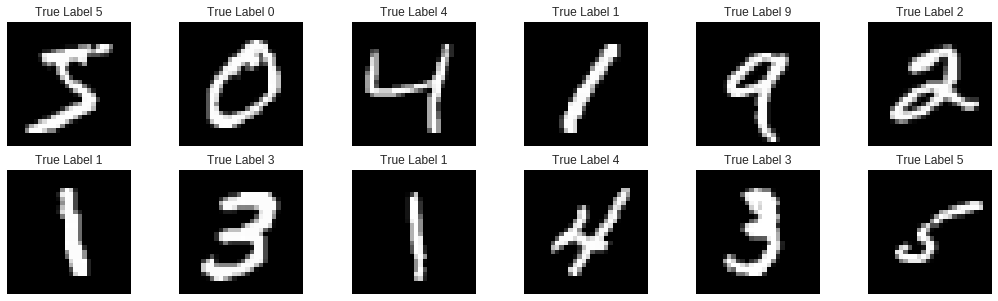
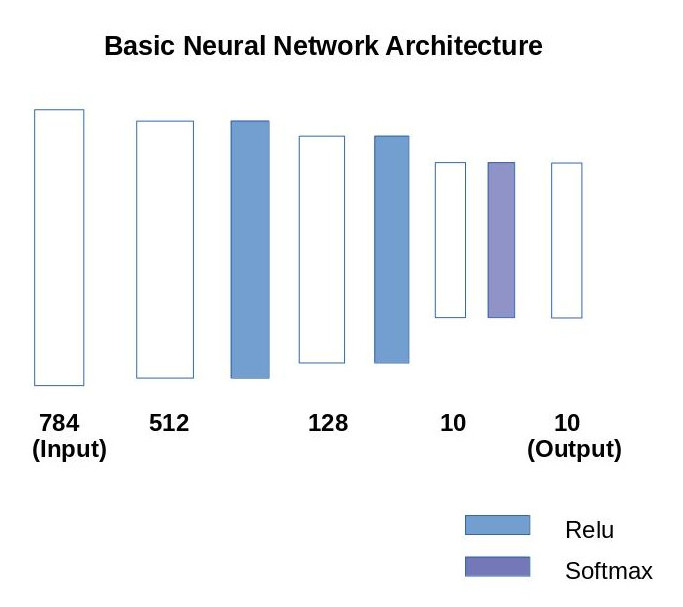

```python
import torch
import torchvision
from torchvision import transforms
from torch import nn

import pandas as pd
import numpy as np
import matplotlib.pyplot as plt
import seaborn as sns
```


```python
# Code for Reproducability
torch.manual_seed(42)
torch.backends.cudnn.deterministic = True
torch.backends.cudnn.benchmark = False
```

#Dataset Analysis


```python
#60000 train images
#10000 test images

train_dataset = torchvision.datasets.MNIST(root = "../data/mnist/",train=True,
                                          transform = transforms.ToTensor(),download=True)

test_dataset = torchvision.datasets.MNIST(root = "../data/mnist/",train=False,
                                         transform = transforms.ToTensor())


```


```python
train_loader = torch.utils.data.DataLoader(dataset = train_dataset,
                                          batch_size = 64,
                                          shuffle = True)

test_loader = torch.utils.data.DataLoader(dataset = test_dataset,
                                          batch_size = 64,
                                          shuffle = False)
```


```python
plt.rcParams["patch.force_edgecolor"] = True
plt.hist(train_dataset.targets.numpy(),label="Train distribution")
plt.hist(test_dataset.targets.numpy(),label="Test distribution")
plt.legend();

```


```python
fig,axarr = plt.subplots(2,6,figsize=(18,5))

for i in range(12):
  plt.subplot(2,6,i+1)
  ax = plt.imshow(train_dataset.data[i],cmap="gray")
  plt.title("True Label {}".format(train_dataset.targets[i]))
  ax.axes.xaxis.set_visible(False)
  ax.axes.yaxis.set_visible(False);
  
  
```





# Simple FeedForward Neural Network
Here we simple flatten all our images and pass through our fully connected Neural network



```python
class NeuralNetwork(nn.Module):
  def __init__(self):
    super(NeuralNetwork,self).__init__()
    self.fc1 = nn.Linear(784,512)
    self.relu = nn.ReLU()
    self.fc2 = nn.Linear(512,128)
    self.fc3 = nn.Linear(128,10)
    self.softmax = nn.Softmax()
   
  def forward(self,x):
    out = self.fc1(x)
    out = self.relu(out)
    out = self.fc2(out)
    out = self.relu(out)
    out = self.fc3(out)
    out = self.softmax(out)
    return out
    
    
  
  
```


```python
model = NeuralNetwork().to("cuda") #for without GPU use "cpu"
```


```python
criterion = nn.CrossEntropyLoss()
optimizer = torch.optim.SGD(model.parameters(),lr=0.03,momentum=0.5)
```


```python
value = model.parameters() # Generator object

print(value.__next__().shape) # weights layer1 :   512*784
print(value.__next__().shape) # bias layer 1 :    512
print(value.__next__().shape) # weights layer 2 :  128*512
print(value.__next__().shape) # bias layer 2 :    128
print(value.__next__().shape) # weights layer 3 :  10*128
print(value.__next__().shape) # bias layer 3:     10


```

    torch.Size([512, 784])
    torch.Size([512])
    torch.Size([128, 512])
    torch.Size([128])
    torch.Size([10, 128])
    torch.Size([10])


```python
total_step = len(train_loader) #937.5
total_step
```


    938


```python
epoches = 20
for epoch in range(epoches):
  for i,(images,labels) in enumerate(train_loader):
    
    images = images.reshape(-1,784).to("cuda")
    labels = labels.to("cuda")
    
    #forward pass and loss calculation
    outputs = model(images)
    loss = criterion(outputs,labels)
    
    #backward pass and gradient update
    optimizer.zero_grad()
    loss.backward()
    optimizer.step()
    
    if( (i+1)%100 == 0):
      print("Epoches {}/{} Steps {}/{} loss: {:.5f}".format(epoch+1,epoches,i+1,
                                                       total_step,loss.item()))
```

    /usr/local/lib/python3.6/dist-packages/ipykernel_launcher.py:16: UserWarning: Implicit dimension choice for softmax has been deprecated. Change the call to include dim=X as an argument.
      app.launch_new_instance()


    Epoches 1/20 Steps 100/938 loss: 2.30031
    Epoches 1/20 Steps 200/938 loss: 2.29746
    Epoches 1/20 Steps 300/938 loss: 2.29199
    Epoches 1/20 Steps 400/938 loss: 2.28084
    Epoches 1/20 Steps 500/938 loss: 2.24396
    Epoches 1/20 Steps 600/938 loss: 2.17666
    Epoches 1/20 Steps 700/938 loss: 2.13435
    Epoches 1/20 Steps 800/938 loss: 1.99006
    Epoches 1/20 Steps 900/938 loss: 1.96435
    Epoches 2/20 Steps 100/938 loss: 1.74870
    Epoches 2/20 Steps 200/938 loss: 1.75070
    Epoches 2/20 Steps 300/938 loss: 1.84562
    Epoches 2/20 Steps 400/938 loss: 1.72505
    Epoches 2/20 Steps 500/938 loss: 1.62490
    Epoches 2/20 Steps 600/938 loss: 1.71405
    Epoches 2/20 Steps 700/938 loss: 1.70891
    Epoches 2/20 Steps 800/938 loss: 1.65773
    Epoches 2/20 Steps 900/938 loss: 1.68115
    Epoches 3/20 Steps 100/938 loss: 1.63239
    Epoches 3/20 Steps 200/938 loss: 1.59041
    Epoches 3/20 Steps 300/938 loss: 1.53719
    Epoches 3/20 Steps 400/938 loss: 1.68045
    Epoches 3/20 Steps 500/938 loss: 1.69825
    Epoches 3/20 Steps 600/938 loss: 1.59440
    Epoches 3/20 Steps 700/938 loss: 1.62334
    Epoches 3/20 Steps 800/938 loss: 1.56323
    Epoches 3/20 Steps 900/938 loss: 1.60077
    Epoches 4/20 Steps 100/938 loss: 1.71538
    Epoches 4/20 Steps 200/938 loss: 1.64566
    Epoches 4/20 Steps 300/938 loss: 1.66489
    Epoches 4/20 Steps 400/938 loss: 1.65538
    Epoches 4/20 Steps 500/938 loss: 1.59311
    Epoches 4/20 Steps 600/938 loss: 1.64330
    Epoches 4/20 Steps 700/938 loss: 1.68714
    Epoches 4/20 Steps 800/938 loss: 1.53277
    Epoches 4/20 Steps 900/938 loss: 1.62971
    Epoches 5/20 Steps 100/938 loss: 1.66113
    Epoches 5/20 Steps 200/938 loss: 1.55436
    Epoches 5/20 Steps 300/938 loss: 1.65603
    Epoches 5/20 Steps 400/938 loss: 1.63071
    Epoches 5/20 Steps 500/938 loss: 1.61316
    Epoches 5/20 Steps 600/938 loss: 1.55987
    Epoches 5/20 Steps 700/938 loss: 1.66165
    Epoches 5/20 Steps 800/938 loss: 1.64852
    Epoches 5/20 Steps 900/938 loss: 1.63500
    Epoches 6/20 Steps 100/938 loss: 1.58274
    Epoches 6/20 Steps 200/938 loss: 1.58093
    Epoches 6/20 Steps 300/938 loss: 1.60887
    Epoches 6/20 Steps 400/938 loss: 1.57792
    Epoches 6/20 Steps 500/938 loss: 1.60186
    Epoches 6/20 Steps 600/938 loss: 1.57730
    Epoches 6/20 Steps 700/938 loss: 1.61534
    Epoches 6/20 Steps 800/938 loss: 1.65581
    Epoches 6/20 Steps 900/938 loss: 1.63134
    Epoches 7/20 Steps 100/938 loss: 1.64896
    Epoches 7/20 Steps 200/938 loss: 1.61861
    Epoches 7/20 Steps 300/938 loss: 1.62685
    Epoches 7/20 Steps 400/938 loss: 1.58126
    Epoches 7/20 Steps 500/938 loss: 1.60712
    Epoches 7/20 Steps 600/938 loss: 1.63851
    Epoches 7/20 Steps 700/938 loss: 1.72416
    Epoches 7/20 Steps 800/938 loss: 1.60919
    Epoches 7/20 Steps 900/938 loss: 1.63615
    Epoches 8/20 Steps 100/938 loss: 1.56135
    Epoches 8/20 Steps 200/938 loss: 1.57328
    Epoches 8/20 Steps 300/938 loss: 1.63808
    Epoches 8/20 Steps 400/938 loss: 1.60775
    Epoches 8/20 Steps 500/938 loss: 1.62081
    Epoches 8/20 Steps 600/938 loss: 1.63429
    Epoches 8/20 Steps 700/938 loss: 1.58707
    Epoches 8/20 Steps 800/938 loss: 1.62901
    Epoches 8/20 Steps 900/938 loss: 1.64105
    Epoches 9/20 Steps 100/938 loss: 1.57207
    Epoches 9/20 Steps 200/938 loss: 1.59527
    Epoches 9/20 Steps 300/938 loss: 1.66521
    Epoches 9/20 Steps 400/938 loss: 1.59438
    Epoches 9/20 Steps 500/938 loss: 1.60233
    Epoches 9/20 Steps 600/938 loss: 1.67797
    Epoches 9/20 Steps 700/938 loss: 1.63529
    Epoches 9/20 Steps 800/938 loss: 1.62440
    Epoches 9/20 Steps 900/938 loss: 1.65772
    Epoches 10/20 Steps 100/938 loss: 1.59183
    Epoches 10/20 Steps 200/938 loss: 1.57165
    Epoches 10/20 Steps 300/938 loss: 1.59513
    Epoches 10/20 Steps 400/938 loss: 1.63931
    Epoches 10/20 Steps 500/938 loss: 1.57171
    Epoches 10/20 Steps 600/938 loss: 1.61592
    Epoches 10/20 Steps 700/938 loss: 1.60498
    Epoches 10/20 Steps 800/938 loss: 1.56522
    Epoches 10/20 Steps 900/938 loss: 1.56050
    Epoches 11/20 Steps 100/938 loss: 1.57540
    Epoches 11/20 Steps 200/938 loss: 1.63069
    Epoches 11/20 Steps 300/938 loss: 1.57645
    Epoches 11/20 Steps 400/938 loss: 1.56622
    Epoches 11/20 Steps 500/938 loss: 1.63236
    Epoches 11/20 Steps 600/938 loss: 1.65536
    Epoches 11/20 Steps 700/938 loss: 1.53595
    Epoches 11/20 Steps 800/938 loss: 1.60820
    Epoches 11/20 Steps 900/938 loss: 1.68956
    Epoches 12/20 Steps 100/938 loss: 1.67697
    Epoches 12/20 Steps 200/938 loss: 1.63038
    Epoches 12/20 Steps 300/938 loss: 1.63643
    Epoches 12/20 Steps 400/938 loss: 1.62834
    Epoches 12/20 Steps 500/938 loss: 1.63197
    Epoches 12/20 Steps 600/938 loss: 1.62745
    Epoches 12/20 Steps 700/938 loss: 1.61745
    Epoches 12/20 Steps 800/938 loss: 1.53114
    Epoches 12/20 Steps 900/938 loss: 1.54376
    Epoches 13/20 Steps 100/938 loss: 1.59765
    Epoches 13/20 Steps 200/938 loss: 1.58585
    Epoches 13/20 Steps 300/938 loss: 1.54849
    Epoches 13/20 Steps 400/938 loss: 1.53108
    Epoches 13/20 Steps 500/938 loss: 1.53743
    Epoches 13/20 Steps 600/938 loss: 1.58220
    Epoches 13/20 Steps 700/938 loss: 1.67308
    Epoches 13/20 Steps 800/938 loss: 1.63276
    Epoches 13/20 Steps 900/938 loss: 1.61873
    Epoches 14/20 Steps 100/938 loss: 1.62012
    Epoches 14/20 Steps 200/938 loss: 1.60068
    Epoches 14/20 Steps 300/938 loss: 1.56525
    Epoches 14/20 Steps 400/938 loss: 1.57277
    Epoches 14/20 Steps 500/938 loss: 1.62603
    Epoches 14/20 Steps 600/938 loss: 1.57399
    Epoches 14/20 Steps 700/938 loss: 1.57872
    Epoches 14/20 Steps 800/938 loss: 1.58580
    Epoches 14/20 Steps 900/938 loss: 1.54822
    Epoches 15/20 Steps 100/938 loss: 1.59071
    Epoches 15/20 Steps 200/938 loss: 1.56974
    Epoches 15/20 Steps 300/938 loss: 1.52829
    Epoches 15/20 Steps 400/938 loss: 1.49942
    Epoches 15/20 Steps 500/938 loss: 1.58354
    Epoches 15/20 Steps 600/938 loss: 1.57174
    Epoches 15/20 Steps 700/938 loss: 1.55008
    Epoches 15/20 Steps 800/938 loss: 1.53852
    Epoches 15/20 Steps 900/938 loss: 1.53108
    Epoches 16/20 Steps 100/938 loss: 1.56947
    Epoches 16/20 Steps 200/938 loss: 1.53834
    Epoches 16/20 Steps 300/938 loss: 1.49740
    Epoches 16/20 Steps 400/938 loss: 1.47141
    Epoches 16/20 Steps 500/938 loss: 1.50826
    Epoches 16/20 Steps 600/938 loss: 1.52467
    Epoches 16/20 Steps 700/938 loss: 1.48072
    Epoches 16/20 Steps 800/938 loss: 1.48583
    Epoches 16/20 Steps 900/938 loss: 1.51581
    Epoches 17/20 Steps 100/938 loss: 1.50293
    Epoches 17/20 Steps 200/938 loss: 1.50466
    Epoches 17/20 Steps 300/938 loss: 1.55331
    Epoches 17/20 Steps 400/938 loss: 1.49876
    Epoches 17/20 Steps 500/938 loss: 1.48589
    Epoches 17/20 Steps 600/938 loss: 1.50320
    Epoches 17/20 Steps 700/938 loss: 1.48954
    Epoches 17/20 Steps 800/938 loss: 1.49868
    Epoches 17/20 Steps 900/938 loss: 1.56159
    Epoches 18/20 Steps 100/938 loss: 1.49278
    Epoches 18/20 Steps 200/938 loss: 1.51280
    Epoches 18/20 Steps 300/938 loss: 1.51624
    Epoches 18/20 Steps 400/938 loss: 1.51788
    Epoches 18/20 Steps 500/938 loss: 1.50291
    Epoches 18/20 Steps 600/938 loss: 1.48706
    Epoches 18/20 Steps 700/938 loss: 1.46799
    Epoches 18/20 Steps 800/938 loss: 1.50881
    Epoches 18/20 Steps 900/938 loss: 1.52250
    Epoches 19/20 Steps 100/938 loss: 1.48714
    Epoches 19/20 Steps 200/938 loss: 1.51436
    Epoches 19/20 Steps 300/938 loss: 1.48192
    Epoches 19/20 Steps 400/938 loss: 1.53698
    Epoches 19/20 Steps 500/938 loss: 1.52841
    Epoches 19/20 Steps 600/938 loss: 1.50570
    Epoches 19/20 Steps 700/938 loss: 1.50519
    Epoches 19/20 Steps 800/938 loss: 1.54015
    Epoches 19/20 Steps 900/938 loss: 1.57290
    Epoches 20/20 Steps 100/938 loss: 1.51143
    Epoches 20/20 Steps 200/938 loss: 1.55017
    Epoches 20/20 Steps 300/938 loss: 1.51141
    Epoches 20/20 Steps 400/938 loss: 1.50286
    Epoches 20/20 Steps 500/938 loss: 1.54968
    Epoches 20/20 Steps 600/938 loss: 1.51222
    Epoches 20/20 Steps 700/938 loss: 1.50965
    Epoches 20/20 Steps 800/938 loss: 1.49329
    Epoches 20/20 Steps 900/938 loss: 1.52629


```python
# Test our model
# Dont require gradient computing , fast and efficent
with torch.no_grad():
  correct = 0
  total = 0
  
  for images,labels in test_loader:
    images = images.reshape(-1,784).to("cuda")
    labels = labels.to("cuda")
    
    outputs = model(images)
    _,predict = torch.max(outputs,1)
    total += len(labels)
    correct += (predict == labels).sum().item()
  print("Accuracy :",correct/total)
    
  
  
```

    /usr/local/lib/python3.6/dist-packages/ipykernel_launcher.py:16: UserWarning: Implicit dimension choice for softmax has been deprecated. Change the call to include dim=X as an argument.
      app.launch_new_instance()


    Accuracy : 0.9532


```python
# look at torch.max operation
a = torch.tensor([[2,3,1],
                  [5,2,7]])
torch.max(a,1) #return value,index
```


    (tensor([3, 7]), tensor([1, 2]))


```python
# Understand some code
a = torch.tensor([1,3,5,6])
b = torch.tensor([1,6,5,7])
(a==b).sum().item()
```


    2


```python
#Save your model

#torch.save(model.state_dict(), 'model.ckpt')
```
